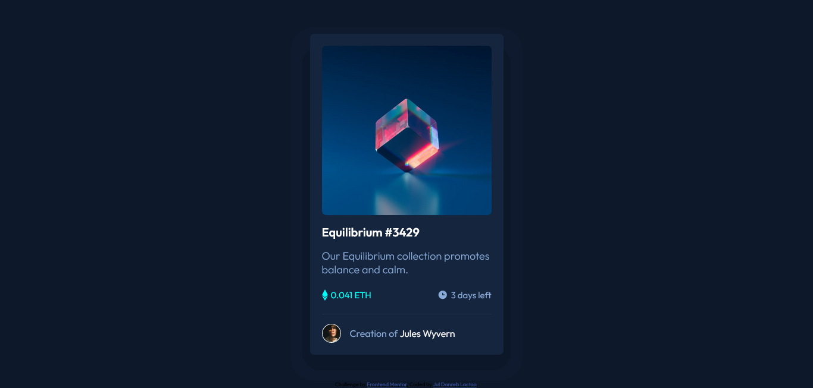

# Frontend Mentor - NFT preview card component solution

This is a solution to the [NFT preview card component challenge on Frontend Mentor](https://www.frontendmentor.io/challenges/nft-preview-card-component-SbdUL_w0U). Frontend Mentor challenges help you improve your coding skills by building realistic projects. 

## Table of contents

- [Overview](#overview)
  - [The challenge](#the-challenge)
  - [Screenshot](#screenshot)
  - [Links](#links)
- [My process](#my-process)
  - [Built with](#built-with)
  - [What I learned](#what-i-learned)
  - [Useful resources](#useful-resources)
- [Author](#author)

## Overview

### The challenge

Users should be able to:

- View the optimal layout depending on their device's screen size
- See hover states for interactive elements

### Screenshot

### Links

- Solution URL: [https://www.frontendmentor.io/challenges/nft-preview-card-component-SbdUL_w0U/hub/nft-preview-card-component-using-flexbox-EBeayfkfm](https://www.frontendmentor.io/challenges/nft-preview-card-component-SbdUL_w0U/hub/nft-preview-card-component-using-flexbox-EBeayfkfm)
- Live Site URL: [https://julfinch.github.io/NFT-Preview-Card-Component/](https://julfinch.github.io/NFT-Preview-Card-Component/)

## My process

1. Created a div to put all details in the nft card .
2. After everything is already in place, I focused next on putting the overlay image of icon-view above the nft art image.
3. Then put the card at the middle of the page.
4. After that, I created two divs to become my primary and secondary shadow at the back of the card to crete depth.

### Built with

- Semantic HTML5 markup
- CSS custom properties
- Flexbox

### What I learned

This challenge gave me my first implementation of overlaying an image over another and applying opacity to it. I've learned a lot about it.

I also was able to play a lot on how to put the shadow effect at the back of the card by creating two divs named as primary-shadow and secondary-shadow.

### Useful resources

- [Image Overlay](https://www.w3schools.com/howto/tryit.asp?filename=tryhow_css_image_overlay_opacity) - This link helped me to play on the concept of overlaying the icon-view above the image-equilibrium.

## Author

- Website - [Add your name here](https://www.your-site.com)
- Frontend Mentor - [@julfinch](https://www.frontendmentor.io/profile/julfinch)
- Twitter - [@julfinch](https://www.twitter.com/julfinch)

